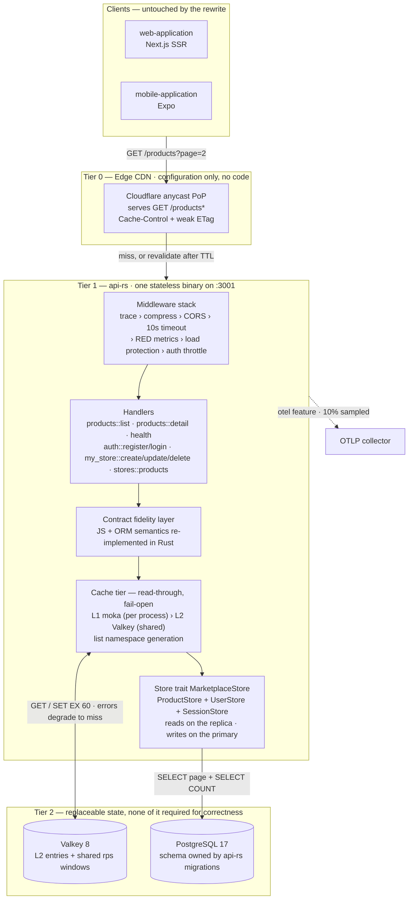
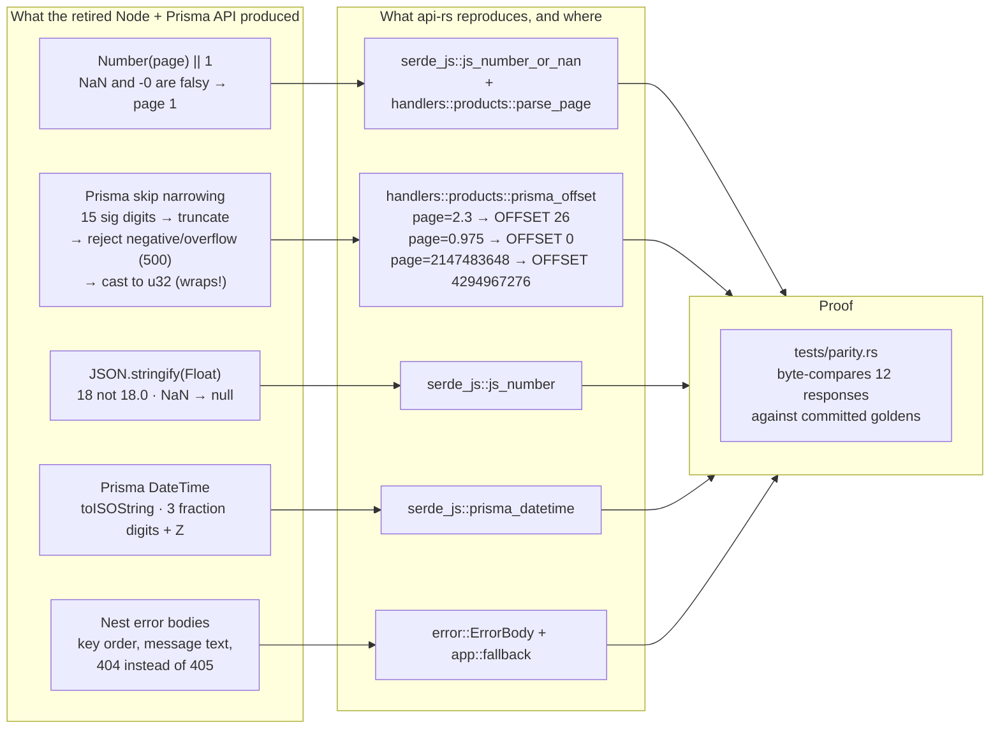
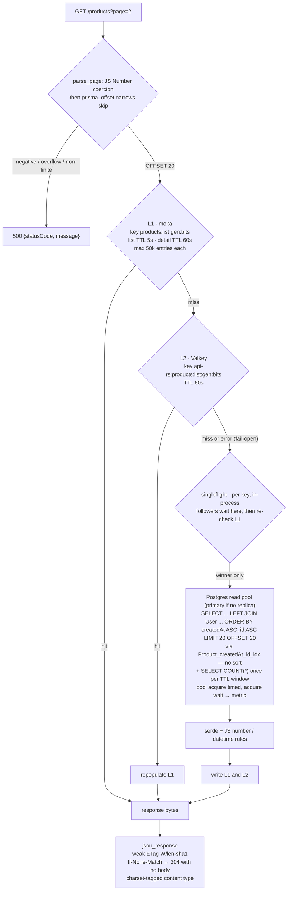
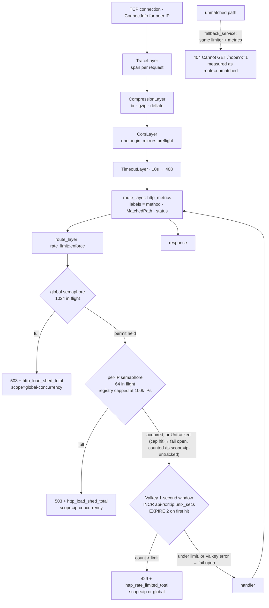
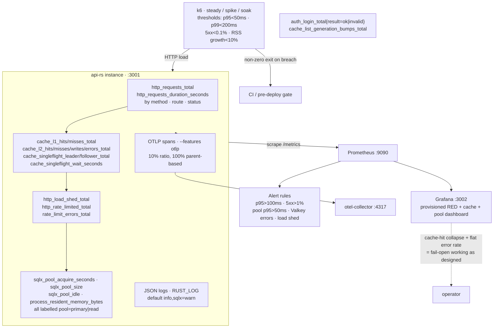
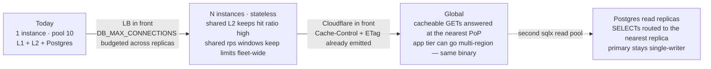

# api-rs — system design

A reading guide to the strategy behind `api-rs/`: what the service is, the
challenges it was built to solve, the capabilities that solve them, and how
each one is wired and verified. Everything below is grounded in the source;
file references are the authority, not this document.

For setup, env vars, and commands, see [`README.md`](README.md). For the
motivation and the rejected alternatives, see
`improve-proposals/implemented/2026-10-01-marketplace-api-high-traffic-performance.md`.

## 1. What this service actually is

A **single stateless HTTP binary on port 3001**. It started as four read-only
GETs and now also carries the seller storefront: a per-user authenticated surface
that owns the only writes.

| Route | Purpose |
|---|---|
| `GET /health` | Readiness probe with a real `SELECT 1` round trip against the primary |
| `GET /products?page=N` | Paginated list, page size fixed at 20 |
| `GET /products/{id}` | Product detail |
| `POST /auth/register` | Create a seller and a session → `201 { user, token }` |
| `POST /auth/login` | Exchange credentials for a token → `200 { user, token }` |
| `POST /auth/logout` | Delete the session row → `204` |
| `GET /auth/me` | The signed-in seller → `200 { user }` |
| `GET /my-store/products?page=N` | The caller's own products. Bearer token, never cached |
| `POST /my-store/products` | Create a product owned by the caller → `201` |
| `PATCH /my-store/products/{id}` | Update one of the caller's products |
| `DELETE /my-store/products/{id}` | Delete one of the caller's products → `204` |
| `GET /stores/{id}` | A store's public record |
| `GET /stores/{id}/products?page=N` | That store's public catalogue |
| `GET /metrics` | Prometheus scrape endpoint (operational, not part of the client contract) |

The rewrite it came from replaced a single-process NestJS/Express API with **no
client, schema, or route changes**: the read contract below is unchanged, and
the storefront routes are additions on top of it. That constraint — *rewrite the
engine, keep the bytes* — still shapes every decision.

## 2. The challenges, stated as engineering problems

The original problem statement is about a marketplace API that could not absorb
traffic. Broken down into things a system design can actually answer:

| # | Challenge | Why it bites |
|---|---|---|
| **X1** | Single-threaded Node ceiling | Per-core throughput saturates; GC pauses land directly in p99. Clustering multiplies heap cost without fixing tail latency. |
| **X2** | Viral spikes reach the origin | No cache of any kind: every request became `findMany` + `count` against Postgres. |
| **X3** | Global users pay transoceanic RTT | One process, one region, no edge tier — full origin processing for every request. |
| **X4** | Connection/pool exhaustion | Concurrency is unbounded, so a burst turns into a connection pile-up and acquire waits. |
| **X5** | Dependency failure becomes an outage | Any cache or limiter added naively becomes a hard dependency and a new failure mode. |
| **X6** | Degradation is unmeasurable | No metrics, no traces, no cache-hit ratio, no pool visibility — so X1–X5 cannot even be tuned. |
| **X7** | Nothing protects the database | No admission control: load reaches Postgres at full strength until it falls over. |
| **X8** | Contract drift during a rewrite | A faster service that serializes `18.0` instead of `18`, or 404s differently, is a broken service. |
| **X9** | Schema ownership ambiguity | A second migration toolchain touching one database invites a second migration owner. Answered by having only one: the crate's own sqlx migrations. |
| **X10** | Performance claims are unfalsifiable | No load tooling and no benchmarks — claims decay into opinions. |

## 3. The capability map

Seven capabilities, mapped to the layer that implements them. Read the boxes
downward: that is the order a request travels.



| Capability | Answers | Implemented in |
|---|---|---|
| **C1 Contract fidelity** | X8 | `serde_js.rs`, `prisma_offset` in `handlers/products.rs`, `error.rs`, golden fixtures in `tests/fixtures/` — derived from those same serializers in `tests/fixtures/mod.rs` |
| **C8 Identity** | — | `auth/token.rs` (opaque tokens, SHA-256 at rest), `auth/password.rs` (argon2id on `spawn_blocking`), `middleware/session.rs` (`FromRequestParts`), `handlers/auth.rs` |
| **C2 Tiered read cache** | X2, X3, X5 | `cache/mod.rs`, `cache/l1.rs` (moka), `cache/l2.rs` (Valkey) |
| **C3 Edge-ready responses** | X3 | `Cache-Control` + weak ETag/`If-None-Match` → 304 in `error.rs`; `X-Cache` marker |
| **C4 Deliberate load shedding** | X4, X7 | `middleware/rate_limit.rs`: concurrency semaphores (503) + Valkey rps windows (429) |
| **C5 Async multi-core runtime** | X1 | tokio `rt-multi-thread` + bounded sqlx pool; one static binary; SIGTERM drain in `main.rs` |
| **C6 Observability** | X6 | `telemetry.rs`, `http_metrics` in `app.rs`, `/metrics`, JSON logs, optional OTLP |
| **C7 Falsifiable gates** | X10 | testcontainers E2E, `tests/parity.rs`, `benches/handlers.rs`, `load-tests/k6/*`, coverage gate |

## 4. C1 — Contract fidelity: emulating JavaScript and Prisma on purpose

The hard part of a "just rewrite it in Rust" is that clients parse *exact
bytes*, including behaviours nobody would design deliberately. api-rs
reproduces them deliberately, and documents the weird ones in comments.



Two details worth internalising, because they are the difference between
"equivalent" and "compatible":

- **Key order is part of the contract.** `ProductJson`, `ProductsPageJson`,
  `HealthBody`, and `ErrorBody` declare fields in the exact order the Node
  serializers emitted them. `tests/parity.rs` compares raw strings, so a
  reordered struct fails the test.
- **Cache headers are additive only.** `Cache-Control`, `ETag`, and `X-Cache`
  are new headers; bodies are byte-identical. Cache hits replay the *same*
  stored bytes, so a hit and a miss cannot diverge.
- **Driver text never reaches the client.** A DB failure yields
  `{"statusCode":500,"message":"Internal server error"}` — note the inverted
  key order and the absent `error` key, matching the old unhandled-exception
  shape. `AppError::ProductNotFound` yields
  `{"message":"Product X not found","error":"Not Found","statusCode":404}`.

**X9 (schema ownership)** is answered by collapsing to a single owner. The crate
is the only thing that touches the database: `migrations/` is applied by the
embedded sqlx migrator in `src/migrations.rs`, and seeding lives in
`src/seed.rs`, both reached through the `api-rs-db` binary. There is no second
toolchain to disagree about the schema, and nothing in the runtime path depends
on a Node package.

## 5. C2 — The read path: two cache tiers, one store, no cascade

`GET /products?page=2` end to end. Note that the cache key is the *float bits*
of the parsed page under a namespace generation, and that a Valkey error takes
the same path as a miss.



Design points that matter:

- **Two TTLs, not one.** List pages get 5 s because they repeat across shoppers
  *and* bound staleness; details get 60 s. One global TTL would be wrong for
  one of them.
- **An L2 hit repopulates L1** (`cache/mod.rs`), so a cold instance warms from
  the shared cache instead of hammering Postgres.
- **A miss on an expired key does not fan out.** `cache/singleflight.rs` hands
  out one lock per cache key; a burst of concurrent misses runs the store call
  once and the rest are answered by re-reading the cache. The check → lock →
  check-again ordering is the whole mechanism, and the guard is a
  `tokio::sync::Mutex` held across `.await` so a cancelled request releases it.
  `cache_singleflight_{leader,follower}_total` and
  `cache_singleflight_wait_seconds` make it measurable.
- **`COUNT(*)` is cached under `products:count`, with the generation folded in**
  too. The count is per-catalog, not per-page, so caching it inside the page
  entry would still re-run it once per page. It carries the generation because
  `total` is the field a newly created product changes most visibly, and a
  retired entry there is the one a shopper would actually notice. Fail-open like
  every other cache read; a real store error still produces the same 500.
- **The list sort is indexed, and collation-pinned.**
  `@@index([createdAt, id])` matches the ordering tuple exactly, so a page is an
  index scan that stops at `LIMIT` instead of a full sort. Measured in
  `load-tests/README.md`. Both indexes and both `ORDER BY` clauses carry an
  explicit `id COLLATE "C"` — they have to, because a collation mismatch between
  the two silently costs the index scan. That pins the tiebreaker to byte order,
  which is what `InMemoryStore` and the golden generator already used; without it
  `id` (a `TEXT` primary key holding mixed-case base64) was being ordered by
  whatever collation the cluster was initialised with.
- **Only L2 misses reach Postgres**, and the pool is bounded
  (`DB_MAX_CONNECTIONS=10`, 2 s acquire timeout) with the acquire wait recorded
  as `sqlx_pool_acquire_seconds` — the earliest visible sign of X4 developing.
  With `DATABASE_READ_URL` set, the public reads use a second pool and `/health`
  keeps pinging the primary.
- **`invalidate_detail(id)` is wired to the write path now**, and it is called
  before the list generation is bumped, together with it — see §12.
- **ETag/304 is a second absorber.** A revalidating client or CDN gets a
  bodiless 304 instead of a 20-item payload, and the ETag is derived from the
  body itself so it can never drift from the content.
- **Seller responses never enter this tier at all.** `/my-store/products` is
  per-user, so there is no shared key that could be correct for more than one
  caller; it is served from the primary and stamped `Cache-Control: no-store`
  along with every other authenticated or mutating response.

### Which pool a query uses

| Query | Pool | Why |
|---|---|---|
| `GET /products`, `GET /products/{id}`, `GET /stores/{id}/products`, `COUNT(*)` | read replica when configured | Public pages. Eventually consistent by choice. |
| `GET /my-store/products` and its `COUNT(*)` | **primary** | The seller's own rows. A lagged read here is a bug, not a trade-off. |
| `POST`/`PATCH`/`DELETE /my-store/products/…` | **primary** | Writes, and the read-back that confirms them. |
| Every user and session lookup | **primary** | Authentication is a question that has to be answered now. |
| `GET /stores/{id}` | **primary** | One row by primary key; cheaper to read than to reason about. |

The asymmetry is deliberate and it is a real trade-off, not a free win: a seller
always sees their own writes immediately, while the *public* marketplace may show
a just-created product only after replica lag. Unsetting `DATABASE_READ_URL`
removes the lag by putting every read on the primary, and it is a one-line config
change the code deliberately does not make on the operator's behalf.

Two consequences worth writing down rather than discovering:

- With a **broken** replica — configured but unreachable, which
  `tests/common/mod.rs`'s `broken_read_pool` covers — writes still succeed and
  owner-scoped reads still succeed, because both go to the primary. Only the
  public marketplace is affected.
- With a **stale but working** replica, a product created while the replica is
  behind does not appear in the public marketplace until it catches up. There is
  no read-repair and no write-through, and adding either would trade this
  asymmetry for a different one.

## 6. C4 + C5 — Middleware stack and load protection

`.layer()` wraps the router, so the **last** layer declared is the **outermost**.
The two positions are not interchangeable. `route_layer` runs only for matched
routes, but a `layer` runs *before* axum matches anything, and `MatchedPath` is
inserted at match time — so a `layer` sees no matched path and would label every
request `route="unmatched"`. That is why the limiter and the RED metrics are
`route_layer`s, and why the fallback — which no `route_layer` can reach — is
served through `fallback_service` carrying its own copy of both rather than
sitting outside them.



A wrong method on a declared route never reaches that node: each route carries
its own `.fallback(any(fallback))`, which sits *inside* the `route_layer`s, so
`POST /products` is shed and measured like any other request. Only a path that
matches no route reaches the fallback, and it is load protected by the same two
middlewares.

The ordering is a design statement:

- **Metrics wrap the limiter**, so shed (503) and limited (429) responses appear
  in the RED series. If the limiter sat outside metrics, the moment you most
  need visibility would be the moment you lose it.
- **Concurrency is checked before rate.** A semaphore bounds work actually in
  flight; an rps counter bounds arrival rate. Shed first protects the process,
  limit second shapes the traffic.
- **Client IP resolution is edge-aware, and which headers to believe is
  configured**: `TRUSTED_PROXY_HEADERS` (default
  `cf-connecting-ip,x-forwarded-for`) → socket peer → `"unknown"`, first hop of a
  list only. Behind Cloudflare the socket peer is the edge, so the order matters.
  Empty means the peer alone, which is the correct posture when nothing trusted
  sits in front — see `README.md` §"Proxy trust and client IPs". One string keys
  all three per-IP limits, so this setting decides whether a client can reset them
  by editing a header.
- **Per-IP tracking is capped** at `RATE_LIMIT_MAX_TRACKED_IPS` (default
  100 000) entries. Past the cap the verdict is `Untracked` — the request still
  faces the global semaphore and the rps windows, and is served rather than shed,
  because registering every spoofed IP would turn a flood of distinct addresses
  into blanket 503s for everyone. It is counted on `http_load_shed_total` as
  `scope=ip-untracked`, so the existing panel and the existing `ApiRsLoadShed`
  rule cover it. The cap is a **high-water mark, not a latch**: reaching it
  sweeps entries whose semaphore has no permit held and no waiter queued, and at
  most `GLOBAL_CONCURRENCY_LIMIT` permits can exist at once, so a full map always
  has idle entries to give back.
- **Semaphore permits are held until the response is produced**, so the limits
  bound real in-flight requests rather than admission bursts.

## 7. X5 — Fail-open matrix

Every optional dependency degrades to "slower", never to "down". This is the
single most important property of the design: **no cached value, counter, or
limiter is worth a failed request.**

| Dependency fails | Behaviour | User sees | Alert |
|---|---|---|---|
| Valkey unreachable at startup | `connect_valkey` returns `None`; L2 and shared limits stay off | Normal 200s from L1 + Postgres | `api-rs listening` + a `warn` log |
| Valkey fails mid-flight | L2 error → treated as a miss; limiter allows | Higher p95, `error rate 0` | `ApiRsValkeyUnavailable` |
| Rate-limit window `INCR` fails | Window skipped, request allowed; the error is counted per `op` | Normal 200s | `ApiRsValkeyUnavailable` |
| Rate-limit window `EXPIRE` fails | Verdict unchanged, but the key has no TTL — one permanent key per request | Normal 200s; Valkey grows | `ApiRsRateLimitWindowTtlFailing` |
| Per-IP registry full | `Untracked`: served with no per-IP permit, still bounded globally | Normal 200s | `ApiRsLoadShed` (`scope=ip-untracked`) |
| Postgres down | Reads 500 with the contract body; `/health` reports `down` | 500 / 503 | `ApiRsHighErrorRate` |
| Postgres slow at startup | `connect_primary_pool` probes with its own 4 s deadline, up to 5 attempts; still exits if it never connects | Startup delayed, then serving | a `warn` per failed attempt |
| Pool saturated | Acquire timeout after 2 s → 500, wait visible as a metric | 500 | `ApiRsPoolAcquireLatency` |
| Concurrency saturated | 503 before work starts | Graceful refusal | `ApiRsLoadShed` |
| rps window exceeded | 429 | Graceful refusal | None by design — expected client behaviour, so it lives on the dashboard (`http_rate_limited_total`) instead of paging |
| Login throttle window exceeded | 429 on `/auth/login`, `/auth/register` | Graceful refusal, marketplace unaffected | `auth_login_total{result="invalid"}` on `api-red.json` |
| Valkey's generation `INCR` fails | The write still retires *this* instance's pages; other instances keep the old namespace until they refresh | One instance briefly serves a pre-write page | `cache_l2_errors_total{op="incr-generation"}` |
| Metrics recorder not installed | `/metrics` returns 503; the service is otherwise unaffected | n/a | startup `eprintln` |
| Traced exporter unavailable | Tracing falls back to JSON logs only | n/a | `eprintln` |

Unmatched paths are **not** an exception to the two rows above. They face the same
semaphores and the same rps windows as every other request, and the 404 body is
unchanged when they are not shed; the 404s that get through are measured as
`route="unmatched"`.

Note the asymmetry: **Postgres is the one hard dependency.** It is also the one
thing the caches exist to protect, and the reason `/health` pings the primary
rather than a cached value.

Being a hard dependency is about *serving*, not about *booting*. The bootstrap
connection therefore does not reuse `DB_ACQUIRE_TIMEOUT_MS`: that knob bounds how
long a **request** waits for a pool connection, and it is deliberately tight so a
saturated pool fails fast and visibly. There is no pool to acquire from at boot,
and `pnpm dev` starts api-rs in the same second as Next/Turbopack, Storybook's
esbuild, Metro and cargo itself — a one-shot 2 s connect there is a coin flip, and
losing it used to kill the process and, through turbo, all four dev tasks. So the
first connection gets its own deadline (4 s) and up to 5 attempts 500 ms apart
— about 22 s before the process gives up. An unreachable Postgres still exits with
the error, because a process that cannot reach its primary must not pretend to be
serving.

sqlx gives no way to widen the first connection alone: `connect_with` bounds it by
the pool's `acquire_timeout` *and* stores that value for the pool's lifetime. So
`connect_primary_pool` verifies reachability with a throwaway single-connection
probe pool carrying the generous deadline, then builds the pool the service keeps
with the operator's strict one, started lazily. The probe is redundant work on
purpose: it is the only way to reach "verified reachable" while leaving every
request's acquire timeout untouched. A malformed `DATABASE_URL` is parsed before
the loop, so a typo fails in microseconds rather than costing five attempts.

## 8. C6 + C7 — Observability and the falsifiable-gate loop

Performance work is only real if degradation is visible and regressions fail a
build. Both are wired: the same Prometheus scrape config runs locally and
against Grafana Cloud, and k6 thresholds fail the process rather than producing
a chart to squint at.

**The metric names themselves are a contract, and they have one owner.**
`src/metrics_names.rs` lists every series `/metrics` can emit and the label keys
each one carries. Its tests compare that list against `src/` in both directions,
against the PromQL in `monitoring/grafana/dashboards/api-red.json` and
`monitoring/rules.yml`, and against the `describe_*` list in `telemetry.rs`. That
is what makes a rename a red test rather than a dead alert: renaming the `status`
label on `http_requests_total` would otherwise leave `ApiRsHighErrorRate`
matching nothing, with no error in either language. The six series nothing reads
are an allowlist with a reason each, so new instrumentation is invisible to
operators by default rather than by accident.



Verification layers, cheapest first:

| Layer | Command | What it proves |
|---|---|---|
| Unit | `cargo test --lib` | Pagination math, JS coercion, ETag logic, error key order, limiter verdicts, window bucketing/TTL/boundary, both limiter fail-open arms, the tracking cap and proxy-header trust |
| Contract | `cargo test --lib` | The metrics contract (`src/metrics_names.rs`): every emitted series, label key, description and `monitoring/` query is declared and matches, and `/metrics` renders `# HELP` for a described series and a zero-valued login counter |
| Contract | `cargo test --test parity` | Twelve responses byte-identical to committed goldens (`responseTime` normalized); the seven success bodies are also regenerated from the production serializers in `tests/fixtures/mod.rs`, so a golden cannot drift from the code that produces it |
| E2E | `cargo test --test e2e_products` | Real HTTP against throwaway Postgres 17 + Valkey 8: page boundaries, 429s, cache hits, degraded `/health` with the DB down, fail-open with Valkey absent, read-replica routing |
| E2E | `cargo test --test e2e_auth` | Real HTTP for the credential endpoints: concurrent registration resolves to one seller, only the token hash is stored, logout revokes immediately, the login throttle is scoped and fail-open |
| E2E | `cargo test --test e2e_my_store` | Real HTTP for the write path: read-your-writes for the seller, `404` not `403` across sellers, a warm cache retired by a write on both this instance and another, `ON DELETE SET NULL` |
| E2E | `cargo test --test seed` | The dev/test split against a real database: `db:seed` writes the seller and no products, `seed-fixtures` adds the e2e fixtures idempotently, and `clear-fixtures` removes exactly those and leaves a created product alone |
| Micro | `cargo bench` | Criterion: list-page cache miss over 50k rows, list hit, detail hit |
| Load | `k6 run load-tests/k6/spike.js` | Origin behaviour under 100 → 5 000 rps; SLO thresholds fail the run |
| Coverage | `pnpm --filter @rnw/api-rs coverage` | 80 % line gate over unit + E2E |

The E2E suite boots containers and applies the same embedded migrator the
served binary carries, so the schema under test is by construction the schema
that ships. It also resolves Colima's non-standard Docker socket, which is what
makes `pnpm test:e2e` work from an IDE or CI runner.

## 9. Scaling out: which challenge each step removes

Every step below is configuration. Nothing in the code assumes one instance.



The last step is no longer aspirational: `DATABASE_READ_URL` plus
`DB_READ_MAX_CONNECTIONS` build a second pool, `list_page`/`count`/`find_by_id`
and `list_public_page_by_owner`/`count_public_by_owner` use it, and `ping` stays
on the primary so `/health` still detects a dead primary. An unreachable replica
degrades to primary reads rather than a dead service.

> **Replica lag is a choice now, not a latent bug.** A just-created product can
> briefly be absent from the public reads, so `GET /products` and
> `GET /stores/{id}/products` are not read-your-writes. Owner-scoped reads and
> every write go to the primary unconditionally, so a seller never sees the lag.
> The remaining exposure is a stale-but-working replica hiding a new product from
> the marketplace until it catches up; unsetting `DATABASE_READ_URL` removes it by
> putting every read on the primary. §5 has the full table.

The seller and the storefront read the *same rows* through *different methods* —
`list_page_for_owner` on the primary, `list_public_page_by_owner` on the read
pool — because they have opposite freshness requirements and one method name
cannot carry both. Neither caller can drift onto the other's pool by accident.

The constraints that make this work, restated as rules:

1. **No instance-local state that matters.** L1 is a cache, not a source of
   truth — a lost L1 costs one Postgres read, never a wrong answer.
2. **Budget `Σ DB_MAX_CONNECTIONS` against the Postgres limit.** Ten replicas
   at the default of 10 is 100 connections; the knob exists so that arithmetic
   is explicit.
3. **The rps limiter lives in Valkey, not in a semaphore**, so limits stay
   meaningful across instances. The semaphores deliberately stay per-instance.
4. **Reads are most of the workload, which is why read replicas are a config
   step rather than a routing project** — except for writes and owner-scoped
   reads, which are pinned to the primary because "did my save work?" is not a
   question worth answering eventually. `DATABASE_READ_URL` is the whole knob.
5. **Deploys drain.** `SIGTERM`/`Ctrl-C` runs `with_graceful_shutdown`, so
   scale-down does not drop in-flight requests.

## 10. Code map

A reading order that follows the request path:

| File | Read it for |
|---|---|
| `src/main.rs` | Bootstrap order, bounded pool, optional Valkey, graceful shutdown |
| `src/config.rs` | Every knob and its default — the service's real policy surface |
| `src/migrations.rs` | The embedded migrator; the single owner of the schema |
| `src/seed.rs` | The demo seller `db:seed` writes, and the e2e fixture products `seed-fixtures` adds and `clear-fixtures` removes |
| `src/app.rs` | `AppState`, the router, middleware order, RED metrics, the 404 fallback |
| `src/middleware/rate_limit.rs` | Shedding and limiting, IP resolution, the fail-open decisions |
| `src/cache/` | Read-through tiering, TTLs, key format, fail-open everywhere; `singleflight.rs` is the stampede guard |
| `src/handlers/products.rs` | Pagination parsing, Prisma offset emulation, the two-phase cache check |
| `src/serde_js.rs` | JS/Prisma serialization semantics |
| `src/store/products.rs` | The SQL, the ordering contract, pool-acquire instrumentation, which pool each query uses |
| `src/store/users.rs`, `src/store/sessions.rs` | The seller and session tables behind their traits; email normalisation, unique-violation classification |
| `src/auth/password.rs`, `src/auth/token.rs` | argon2id helpers, and why session tokens use SHA-256 rather than a KDF |
| `src/middleware/session.rs` | The `Bearer` extractor, and why four failures produce one answer |
| `src/handlers/auth.rs`, `my_store.rs`, `stores.rs` | The credential endpoints, the seller's CRUD, the public storefront |
| `src/telemetry.rs` | Metrics/logging/traces bootstrap, the per-series `# HELP` text, and the 5 s samplers |
| `src/metrics_names.rs` | The owner of every metric name and label key, and the parity tests that keep `src/`, `telemetry.rs` and `monitoring/` from drifting apart |
| `src/error.rs` | Error shapes, weak ETag, 304 handling |
| `tests/`, `benches/` | The verification contract; `tests/fixtures/` is the golden set, derived in `tests/fixtures/mod.rs` |

## 11. Trade-offs, stated plainly

- **A cache can serve stale data.** 5 s for lists, 60 s for details and L2, and
  for the list *namespace* it is `L2_TTL_SECS` on instances that did not perform
  the write. That last one is wider than the 5 s the read path used to promise,
  and it is the deliberate cost of not reading the generation on every request —
  §12 has the arithmetic.
- **A write is not a broker, because one write has one consumer.** A new product
  makes the cached public pages wrong; `invalidate_detail` + `bump` is the whole
  reaction. The ladder in §12 is unchanged, and the first rung is still the
  right one.
- **Ownership failures are `404`, never `403`.** A 403 confirms to a stranger
  that an id exists on a public catalogue, which is an enumeration oracle on a
  catalogue where every id is already enumerable — the 403 just says whose.
- **A credential does not get the cart's storage.** Both live in `localStorage`
  on web and an in-memory map on native, and that is fine for a cart and not fine
  for a session token. `expo-secure-store` (native) and an `httpOnly` cookie
  (web) are the fixes, and both are out of scope here for reasons recorded in
  `components-library/src/business/AuthScreen/useSessionStore.ts`.
- **`/products` runs two queries** (`page` + `COUNT(*)`) because the contract
  requires an exact `total`. That is fidelity, not an oversight; a keyset
  pagination redesign would change the envelope. The count is cached under
  `products:count`, so the second query is paid once per TTL window rather than
  once per request.
- **Stampede protection is per instance.** `cache/singleflight.rs` collapses
  concurrent fills of one key in one process, so a cold burst costs one store
  call instead of N. Across instances the collapse is Valkey's job (an L2 hit
  never reaches Postgres at all). A distributed lock would put a network round
  trip on the miss path — the one path §7 says must fail open — to save two
  queries per cold key.
- **The `otlp` feature is opt-in** because it roughly doubles a cold build.
  `/metrics` and JSON logs carry the observability load by default.
- **`/products` deep offsets stay slow.** `OFFSET 4294967276` is accepted for
  contract compatibility, and Postgres still has to walk the rows. The
  `(createdAt, id)` index makes a shallow page an index scan that stops at
  `LIMIT`, but it cannot stop a scan that must first discard every skipped row
  (measured: 19.8 ms and 100 020 rows read at `OFFSET 100000` — see
  `load-tests/README.md`). Keyset pagination is the fix, and it is blocked on
  `total` being in the contract, not on effort.
- **The list index is not covering.** `(createdAt, id)` removes the sort but
  not the heap fetch, so every returned row still costs an index-to-heap lookup.
  Making it covering would mean indexing `title`, `price`, and the rest of the
  projection, widening the write cost for a read-only catalog whose pages are
  already cached. `Product_ownerId_createdAt_id_idx` inherits the same caveat,
  and the store `LEFT JOIN` adds a lookup per row on top of it.
- **The session table is bounded by age, not by count.** A login deletes that
  seller's rows already past `SESSION_TTL_SECS`, so `"Session"` no longer grows
  without limit — it did for as long as only logout and the unreachable
  account-deletion route removed a row. It needs no scheduler and no new config
  key, because the login that adds a row is also the moment the seller's dead
  rows are worth reclaiming. Two things follow that are deliberate. The residual
  is real: a seller who logs in many times inside one TTL window holds one live
  row per login until it expires, because capping *live* sessions would revoke a
  device the seller is still using and that is not a change to make silently.
  And `Session_expiresAt_idx` is now read by no query at all — the per-user
  delete filters on `"userId"`, which is why `Session_userId_idx` was added —
  so it is kept on the expectation that a *global* sweep is the right thing to
  add eventually, at the cost of a write per login on an append-only table. The
  cleanup is fail-open: a sweep that errors is warned and counted, never
  propagated, because the credential being minted is unaffected by it.
- **`api-rs-db` ships separately from the server binary.** The release image
  contains only `--bin api-rs`, so applying migrations means running the tool
  from a checkout. The alternative — migrating on startup — would give every
  replica write access to the schema, which is a larger change than the problem
  warrants.

## 12. The write path, and why there is no broker

The service started read-only, and it still has no event bus, no job queue, and no
`events/` module. This section exists so the *next* mutation lands on a considered
design instead of a default one, because the proposals for reviews, stock,
coupons, and order history all require writes and the default answer to
"event-driven marketplace" is a broker.

### The trigger condition

**A write exists *and* at least two consumers must react to it.** One consumer
means call it directly — that is what `invalidate_detail` became, and a message
bus in front of a single caller is pure latency.

### The ladder, cheapest first

Stop at the first rung that actually hurts.

| Rung | Cost | Use when |
|---|---|---|
| Direct call | free | One consumer. This is `invalidate_detail`. |
| Postgres transactional outbox | free — same DB | Consumers must not miss an event, or must observe it in the same transaction as the write |
| Valkey Streams | free — Valkey is already deployed, `redis` already has `tokio-comp` | At-least-once delivery, consumer groups, replay |
| Valkey Pub/Sub | free, at-most-once | Only invalidation-style hints where a dropped message is recoverable by TTL |
| NATS JetStream | small | Genuine cross-service fan-out with durability |
| Kafka / Redpanda | real money | High-throughput log ingestion, replay over days, many independent consumer groups |

The ladder did not change when the first mutations landed: a seller creating a
product has exactly one reaction — the cached public pages are now wrong — and
that is a direct call, not a message. Revisit when a second, genuinely
independent consumer appears.

The first three rungs need **no new infrastructure**: Postgres and Valkey are
both already deployed, and the transactional outbox needs no broker at all.

### The rules

1. **Never in the request path.** The write returns when the DB transaction
   commits; delivery is asynchronous. This follows directly from §7's fail-open
   matrix — the moment a user's write blocks on a broker round trip, a broker
   outage becomes a write outage, which is the failure mode this service is
   built to avoid.
2. **Event-driven architecture is a decoupling tool, not a performance tool.**
   It cannot make a `GET` faster. A broker in the read path adds a network hop
   and a new failure mode to the hottest code in the service. If someone reaches
   for Kafka to solve a latency problem, the latency problem was `COUNT(*)`
   without an index or a cache stampede — both of which are now fixed without
   it.
3. **We are not adding Kafka now.** Recorded explicitly so the next person
   re-opens it as a *decision* with evidence, rather than inheriting it as an
   assumption. Revisit when a proposal can name a consumer count above two and a
   delivery guarantee Pub/Sub cannot meet.

### The list-invalidation hole — and how it was actually closed

`invalidate_detail(id)` deletes `products:detail:<id>` from both tiers. List keys
are namespace-qualified, and even before they were, there was no way to enumerate
or delete them all: a price change would have left every cached list page stale
until its 5 s TTL expired. The answer, as first sketched here, was a namespace
generation counter at `api-rs:products:list:gen` folded into every list key.

**It shipped with one deliberate deviation.** The sketch read it from Valkey on
every list request:

```rust
// read side, once per request
let generation: i64 = cache.get_generation().await?;      // default 0
let key = format!("products:list:{generation}:{}", query.page.to_bits());

// write side, after the transaction commits
cache.invalidate_detail(id).await;                          // 1: this product
cache.bump_list_generation().await;                         // 2: every page
```

That is one extra Valkey round trip in front of the hottest L1 hit path in a
service built for high traffic, on every request, to protect a counter that
changes perhaps a few times an hour. So it is **held in process instead**:

```rust
// read side — a relaxed atomic load, not a round trip
let generation = cache.generation();                        // default 0
let key = format!("products:list:{generation}:{}", query.page.to_bits());

// write side — INCR for the fleet, then write through locally
cache.invalidate_detail(id).await;
cache.bump_list_generation().await;                         // local value updates too

// and a background task re-reads the shared counter
cache.spawn_generation_refresher(config.l2_ttl);
```

**What that costs, precisely.** The instance that performed a write is correct
immediately. An instance that did *not* keeps addressing the old namespace until
its refresher runs, so it can serve a pre-write page for up to one
`L2_TTL_SECS` interval — plus whatever is left of the retired entry's own TTL,
since bumping renames the namespace rather than evicting. With the defaults that
is worse than the 5 s list TTL the read path used to promise, and it is the price
paid for not putting a network hop in front of every list request. Setting
`L2_TTL_SECS` lower narrows it; making the refresher read on every request would
close it entirely and cost the round trip this design exists to avoid.

`INCR` retires every list page in both tiers at once: old keys are simply never
addressed again and expire on their own TTL. Roughly 15 lines, one round trip on
the write path only, no key enumeration and no `SCAN`. The **order matters** — bump
the generation *after* invalidating the detail entry, so a reader can never
observe a fresh detail entry alongside a stale list that was filled before the
write.

**Three list families fold in the counter**, not one. A new product is visible in
`products:list` and in `stores:{id}:products:list` — the seller's own public
storefront — and both must be retired or the storefront would keep selling a
product the marketplace has forgotten. `products:count` carries it too. The
owner-scoped `/my-store/products` list is deliberately *not* cached, so it has
nothing to retire.

Note the interaction with §5: bumping the generation does not evict anything,
it only renames the namespace. A stale list entry therefore still occupies L1
until its TTL, which is why the counter is paired with short list TTLs rather
than replacing them.
