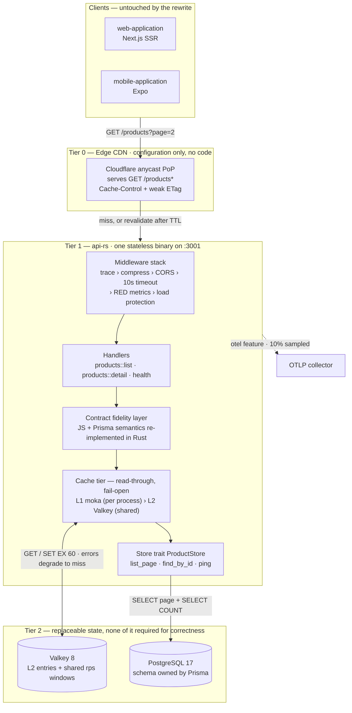
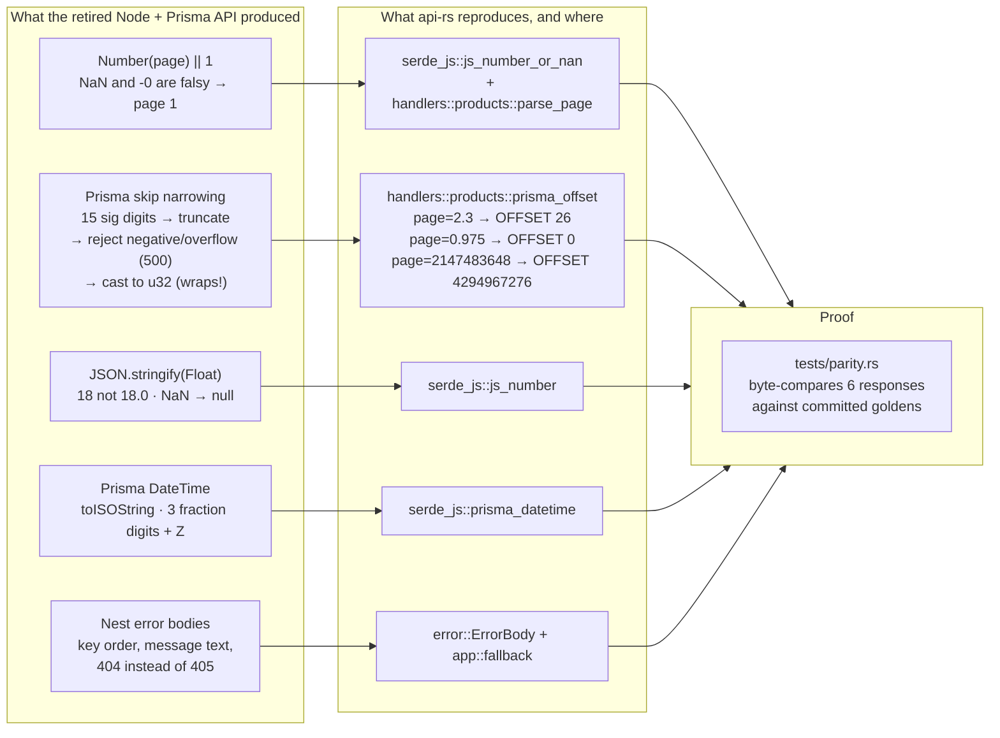
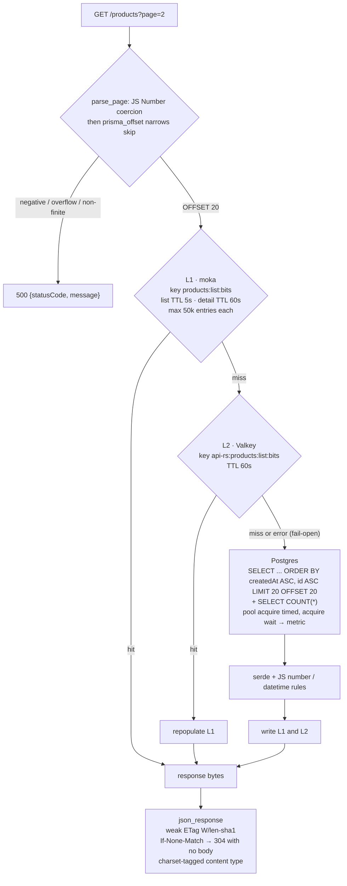
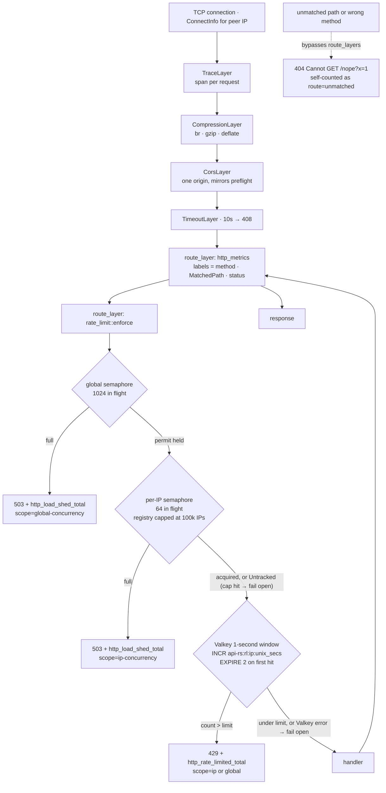
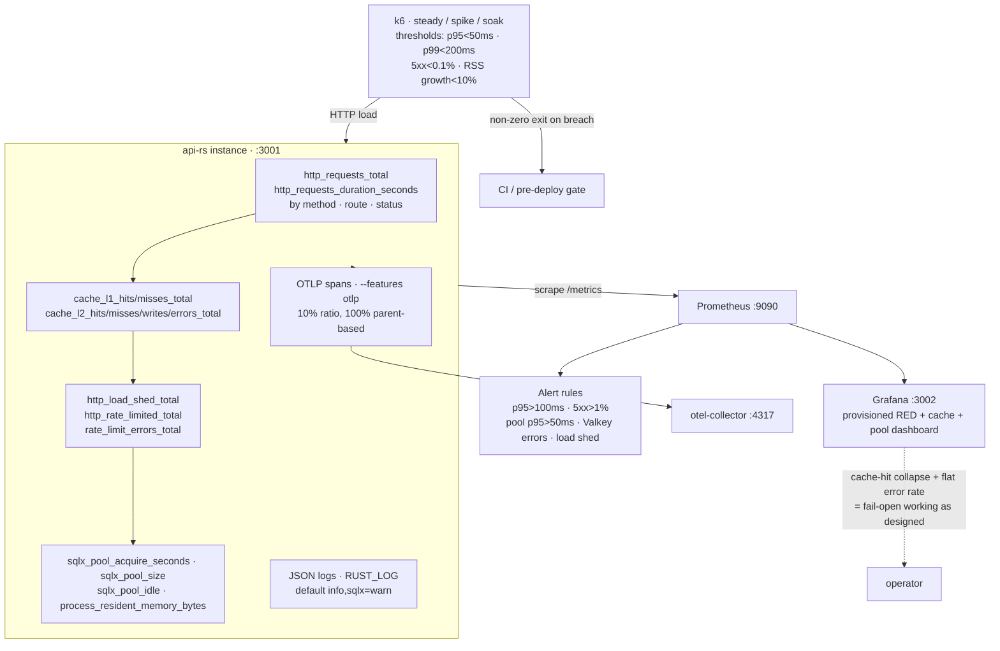
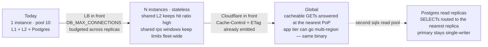

# api-rs — system design

A reading guide to the strategy behind `api-rs/`: what the service is, the
challenges it was built to solve, the capabilities that solve them, and how
each one is wired and verified. Everything below is grounded in the source;
file references are the authority, not this document.

For setup, env vars, and commands, see [`README.md`](README.md). For the
motivation and the rejected alternatives, see
`improve-proposals/implemented/2026-10-01-marketplace-api-high-traffic-performance.md`.

## 1. What this service actually is

A **single stateless HTTP binary on port 3001** that answers four GET routes:

| Route | Purpose |
|---|---|
| `GET /health` | Readiness probe with a real `SELECT 1` round trip against the primary |
| `GET /products?page=N` | Paginated list, page size fixed at 20 |
| `GET /products/{id}` | Product detail |
| `GET /metrics` | Prometheus scrape endpoint (operational, not part of the client contract) |

It replaced a single-process NestJS/Express API with **no client, schema, or
route changes**. The web and mobile apps still default to `localhost:3001` and
parse the exact same JSON. That constraint — *rewrite the engine, keep the
bytes* — shapes every decision below.

## 2. The challenges, stated as engineering problems

The original problem statement is about a marketplace API that could not absorb
traffic. Broken down into things a system design can actually answer:

| # | Challenge | Why it bites |
|---|---|---|
| **X1** | Single-threaded Node ceiling | Per-core throughput saturates; GC pauses land directly in p99. Clustering multiplies heap cost without fixing tail latency. |
| **X2** | Viral spikes reach the origin | No cache of any kind: every request became `findMany` + `count` against Postgres. |
| **X3** | Global users pay transoceanic RTT | One process, one region, no edge tier — full origin processing for every request. |
| **X4** | Connection/pool exhaustion | Concurrency is unbounded, so a burst turns into a connection pile-up and acquire waits. |
| **X5** | Dependency failure becomes an outage | Any cache or limiter added naively becomes a hard dependency and a new failure mode. |
| **X6** | Degradation is unmeasurable | No metrics, no traces, no cache-hit ratio, no pool visibility — so X1–X5 cannot even be tuned. |
| **X7** | Nothing protects the database | No admission control: load reaches Postgres at full strength until it falls over. |
| **X8** | Contract drift during a rewrite | A faster service that serializes `18.0` instead of `18`, or 404s differently, is a broken service. |
| **X9** | Schema ownership ambiguity | Two toolchains (Prisma + Rust) touching one database invites a second migration owner. |
| **X10** | Performance claims are unfalsifiable | No load tooling and no benchmarks — claims decay into opinions. |

## 3. The capability map

Seven capabilities, mapped to the layer that implements them. Read the boxes
downward: that is the order a request travels.

| Capability | Answers | Implemented in |
|---|---|---|
| **C1 Contract fidelity** | X8 | `serde_js.rs`, `prisma_offset` in `handlers/products.rs`, `error.rs`, golden fixtures in `tests/fixtures/` |
| **C2 Tiered read cache** | X2, X3, X5 | `cache/mod.rs`, `cache/l1.rs` (moka), `cache/l2.rs` (Valkey) |
| **C3 Edge-ready responses** | X3 | `Cache-Control` + weak ETag/`If-None-Match` → 304 in `error.rs`; `X-Cache` marker |
| **C4 Deliberate load shedding** | X4, X7 | `middleware/rate_limit.rs`: concurrency semaphores (503) + Valkey rps windows (429) |
| **C5 Async multi-core runtime** | X1 | tokio `rt-multi-thread` + bounded sqlx pool; one static binary; SIGTERM drain in `main.rs` |
| **C6 Observability** | X6 | `telemetry.rs`, `http_metrics` in `app.rs`, `/metrics`, JSON logs, optional OTLP |
| **C7 Falsifiable gates** | X10 | testcontainers E2E, `tests/parity.rs`, `benches/handlers.rs`, `load-tests/k6/*`, coverage gate |

## 4. C1 — Contract fidelity: emulating JavaScript and Prisma on purpose

The hard part of a "just rewrite it in Rust" is that clients parse *exact
bytes*, including behaviours nobody would design deliberately. api-rs
reproduces them deliberately, and documents the weird ones in comments.

Two details worth internalising, because they are the difference between
"equivalent" and "compatible":

- **Key order is part of the contract.** `ProductJson`, `ProductsPageJson`,
  `HealthBody`, and `ErrorBody` declare fields in the exact order the Node
  serializers emitted them. `tests/parity.rs` compares raw strings, so a
  reordered struct fails the test.
- **Cache headers are additive only.** `Cache-Control`, `ETag`, and `X-Cache`
  are new headers; bodies are byte-identical. Cache hits replay the *same*
  stored bytes, so a hit and a miss cannot diverge.
- **Driver text never reaches the client.** A DB failure yields
  `{"statusCode":500,"message":"Internal server error"}` — note the inverted
  key order and the absent `error` key, matching the old unhandled-exception
  shape. `AppError::ProductNotFound` yields
  `{"message":"Product X not found","error":"Not Found","statusCode":404}`.

**X9 (schema ownership)** is answered by *not* solving it in Rust: `api-rs`
reads tables with sqlx, but `prisma/schema.prisma` + `prisma/migrations/` +
`prisma.config.ts` remain the only migration authority, driven by the
`db:migrate` / `db:seed` scripts. The generated Prisma client exists only for
the seed script.

## 5. C2 — The read path: two cache tiers, one store, no cascade

`GET /products?page=2` end to end. Note that the cache key is the *float bits*
of the parsed page, and that a Valkey error takes the same path as a miss.

Design points that matter:

- **Two TTLs, not one.** List pages get 5 s because they repeat across shoppers
  *and* bound staleness; details get 60 s. One global TTL would be wrong for
  one of them.
- **An L2 hit repopulates L1** (`cache/mod.rs`), so a cold instance warms from
  the shared cache instead of hammering Postgres.
- **Only L2 misses reach Postgres**, and the pool is bounded
  (`DB_MAX_CONNECTIONS=10`, 2 s acquire timeout) with the acquire wait recorded
  as `sqlx_pool_acquire_seconds` — the earliest visible sign of X4 developing.
- **`invalidate_detail(id)` already exists** in `cache/mod.rs` and deletes from
  both tiers. It is not wired to a route because the service is read-only; it
  is the seam the first write endpoint will use. Nothing else is needed.
- **ETag/304 is a second absorber.** A revalidating client or CDN gets a
  bodiless 304 instead of a 20-item payload, and the ETag is derived from the
  body itself so it can never drift from the content.

## 6. C4 + C5 — Middleware stack and load protection

`.layer()` wraps the router, so the **last** layer declared is the **outermost**.
`route_layer` runs only for matched routes — which is why `app::fallback`
increments its own counter: an unmatched request has no `MatchedPath`.

The ordering is a design statement:

- **Metrics wrap the limiter**, so shed (503) and limited (429) responses appear
  in the RED series. If the limiter sat outside metrics, the moment you most
  need visibility would be the moment you lose it.
- **Concurrency is checked before rate.** A semaphore bounds work actually in
  flight; an rps counter bounds arrival rate. Shed first protects the process,
  limit second shapes the traffic.
- **Client IP resolution is edge-aware**: `CF-Connecting-IP` →
  first `X-Forwarded-For` hop → socket peer → `"unknown"`. Behind Cloudflare
  the socket peer is the edge, so the order matters.
- **Per-IP tracking is capped** at 100 000 entries. Past the cap the verdict is
  `Untracked` — the request still faces the global semaphore and the rps
  windows. Registering every spoofed IP would turn a flood of distinct
  addresses into blanket 503s for everyone.
- **Semaphore permits are held until the response is produced**, so the limits
  bound real in-flight requests rather than admission bursts.

## 7. X5 — Fail-open matrix

Every optional dependency degrades to "slower", never to "down". This is the
single most important property of the design: **no cached value, counter, or
limiter is worth a failed request.**

| Dependency fails | Behaviour | User sees | Alert |
|---|---|---|---|
| Valkey unreachable at startup | `connect_valkey` returns `None`; L2 and shared limits stay off | Normal 200s from L1 + Postgres | `api-rs listening` + a `warn` log |
| Valkey fails mid-flight | L2 error → treated as a miss; limiter allows | Higher p95, `error rate 0` | `ApiRsValkeyUnavailable` |
| Postgres down | Reads 500 with the contract body; `/health` reports `down` | 500 / 503 | `ApiRsHighErrorRate` |
| Pool saturated | Acquire timeout after 2 s → 500, wait visible as a metric | 500 | `ApiRsPoolAcquireLatency` |
| Concurrency saturated | 503 before work starts | Graceful refusal | `ApiRsLoadShed` |
| rps window exceeded | 429 | Graceful refusal | None by design — expected client behaviour, so it lives on the dashboard (`http_rate_limited_total`) instead of paging |
| Metrics recorder not installed | `/metrics` returns 503; the service is otherwise unaffected | n/a | startup `eprintln` |
| Traced exporter unavailable | Tracing falls back to JSON logs only | n/a | `eprintln` |

Note the asymmetry: **Postgres is the one hard dependency.** It is also the one
thing the caches exist to protect, and the reason `/health` pings the primary
rather than a cached value.

## 8. C6 + C7 — Observability and the falsifiable-gate loop

Performance work is only real if degradation is visible and regressions fail a
build. Both are wired: the same Prometheus scrape config runs locally and
against Grafana Cloud, and k6 thresholds fail the process rather than producing
a chart to squint at.

Verification layers, cheapest first:

| Layer | Command | What it proves |
|---|---|---|
| Unit | `cargo test --lib` | Pagination math, JS coercion, ETag logic, error key order, limiter verdicts |
| Contract | `cargo test --test parity` | Six responses byte-identical to committed goldens (`responseTime` normalized) |
| E2E | `cargo test --test e2e_products` | Real HTTP against throwaway Postgres 17 + Valkey 8: page boundaries, 429s, cache hits, degraded `/health` with the DB down, fail-open with Valkey absent |
| Micro | `cargo bench` | Criterion: list-page cache miss over 50k rows, list hit, detail hit |
| Load | `k6 run load-tests/k6/spike.js` | Origin behaviour under 100 → 5 000 rps; SLO thresholds fail the run |
| Coverage | `pnpm --filter @rnw/api-rs coverage` | 80 % line gate over unit + E2E |

The E2E suite boots containers with the Prisma migration SQL compiled in via
`include_str!`, so the schema under test can never drift from the committed
migrations. It also resolves Colima's non-standard Docker socket, which is what
makes `pnpm test:e2e` work from an IDE or CI runner.

## 9. Scaling out: which challenge each step removes

Every step below is configuration. Nothing in the code assumes one instance.

The constraints that make this work, restated as rules:

1. **No instance-local state that matters.** L1 is a cache, not a source of
   truth — a lost L1 costs one Postgres read, never a wrong answer.
2. **Budget `Σ DB_MAX_CONNECTIONS` against the Postgres limit.** Ten replicas
   at the default of 10 is 100 connections; the knob exists so that arithmetic
   is explicit.
3. **The rps limiter lives in Valkey, not in a semaphore**, so limits stay
   meaningful across instances. The semaphores deliberately stay per-instance.
4. **Reads are the only workload**, which is why read replicas are a config
   step rather than a routing project.
5. **Deploys drain.** `SIGTERM`/`Ctrl-C` runs `with_graceful_shutdown`, so
   scale-down does not drop in-flight requests.

## 10. Code map

A reading order that follows the request path:

| File | Read it for |
|---|---|
| `src/main.rs` | Bootstrap order, bounded pool, optional Valkey, graceful shutdown |
| `src/config.rs` | Every knob and its default — the service's real policy surface |
| `src/app.rs` | `AppState`, the router, middleware order, RED metrics, the 404 fallback |
| `src/middleware/rate_limit.rs` | Shedding and limiting, IP resolution, the fail-open decisions |
| `src/cache/` | Read-through tiering, TTLs, key format, fail-open everywhere |
| `src/handlers/products.rs` | Pagination parsing and Prisma offset emulation |
| `src/serde_js.rs` | JS/Prisma serialization semantics |
| `src/store/products.rs` | The SQL, the ordering contract, pool-acquire instrumentation |
| `src/telemetry.rs` | Metrics/logging/traces bootstrap and the 5 s samplers |
| `src/error.rs` | Error shapes, weak ETag, 304 handling |
| `tests/`, `benches/` | The verification contract; `tests/fixtures/` is the golden set |

## 11. Trade-offs, stated plainly

- **A cache can serve stale data.** 5 s for lists, 60 s for details and L2.
  This is a deliberate product decision for a read-mostly marketplace; a
  write endpoint must call `invalidate_detail` (and needs a list-key strategy)
  the moment it lands.
- **`/products` runs two queries** (`page` + `COUNT(*)`) because the contract
  requires an exact `total`. That is fidelity, not an oversight; a keyset
  pagination redesign would change the envelope.
- **No stampede protection on a cold L2.** A burst on an expired key can fan
  out to Postgres. Singleflight would fix it, and the concurrency limiter caps
  the damage meanwhile. Worth doing before a real flash crowd.
- **The `otlp` feature is opt-in** because it roughly doubles a cold build.
  `/metrics` and JSON logs carry the observability load by default.
- **`/products` deep offsets stay slow.** `OFFSET 4294967276` is accepted for
  contract compatibility, and Postgres still has to walk the rows.