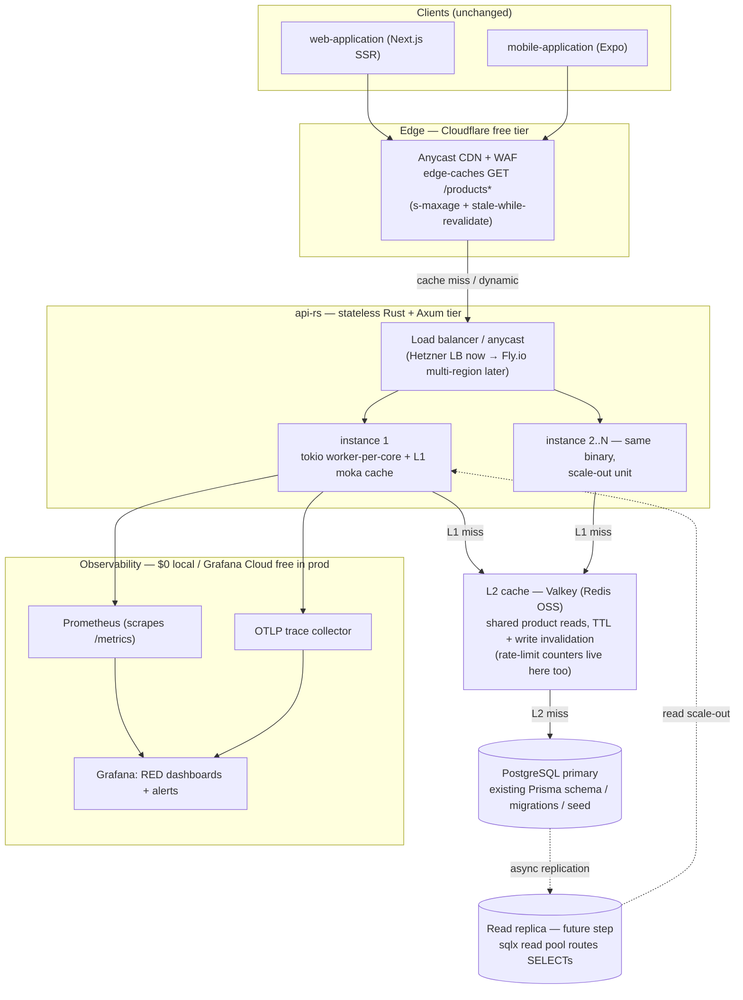
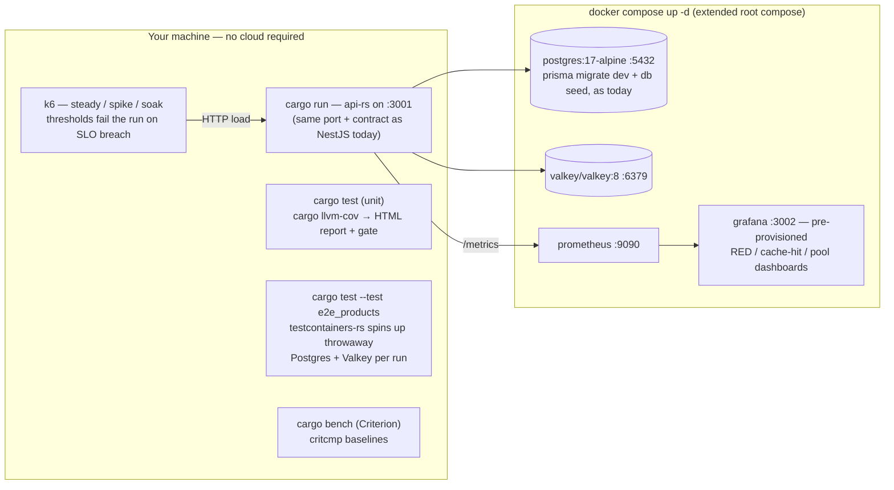

# High-traffic, globally scalable marketplace API (Rust rewrite behind the existing contract)

## Problem / opportunity

The marketplace API (`api/`) is a single NestJS 12 + Express process
(`api/src/main.ts` — one `app.listen(3001)`, no clustering) backed by Prisma 7
→ PostgreSQL, with exactly three routes: `GET /products?page=N` (returning
`{items, page, limit: 20, total, hasNextPage}` — two Postgres queries per call,
`findMany` + `count`, in `api/src/products/products.service.ts`),
`GET /products/:id`, and `GET /health` (terminus + Prisma ping). There is no
cache layer of any kind, no CDN/edge, no rate limiting, no compression, no
metrics endpoint, and no load-testing tooling anywhere in the repo. Both
clients point straight at `:3001` (`NEXT_PUBLIC_API_URL` in
`web-application/lib/api.ts`; `EXPO_PUBLIC_API_URL` / Metro-host derivation in
`mobile-application/src/api/client.ts`).

That shape hits a wall the moment traffic stops being a trickle:

1. **High traffic spikes** — nothing absorbs a spike today: a viral burst
   becomes N × 2 Postgres queries with zero caching. Node's single event loop
   per process means any CPU-bound work (JSON serialization of a 20-item page
   is small, but compression, validation, and query overhead add up) queues
   behind everything else in flight, and V8 GC pauses show up directly in
   p99.
2. **Global scale** — one process in one region; every request pays
   transoceanic RTT plus full origin processing, and there is no edge layer.
3. **Large numbers of concurrent users without degradation** — Express/Node
   handles concurrency by adding *processes* (`cluster`/pm2), each with its
   own ~50–100 MB heap and its own DB pool; per-core throughput and tail
   latency degrade under load instead of staying flat.
4. **JavaScript/Node is single-threaded** — the fundamental ceiling called
   out in the brief. Cluster mode is a workaround (N copies of the same heap,
   IPC complexity, unchanged GC behavior), not a fix.
5. **Everything else in the architecture** — no cache tiers, no CDN, no
   compression, no pool tuning, no observability: degradation today can't
   even be *measured*, let alone fixed.

At the same time, the marketplace read path is extremely cacheable — products
change rarely and list pages repeat across shoppers — which makes it the
cheapest possible workload to make fast: a compiled, multi-core, GC-free
service behind tiered caches and an edge CDN wins by an order of magnitude on
exactly this shape.

## Proposed approach

### Goals / non-goals

Goals:

- Serve the **existing REST contract byte-for-byte** from a service built for
  spike traffic: **Rust + Axum**, stateless, multi-core, no GC pauses.
- Global-capable on a **$0–10/month** budget: Cloudflare free edge + one
  cheap VPS now, with a documented multi-region / read-replica scale path
  that requires no rework.
- **Everything runs on one laptop**: docker compose stack, unit + E2E tests
  with coverage gates, k6 load scenarios with SLO thresholds, live
  Prometheus/Grafana dashboards.

Non-goals:

- No client changes: same routes, same JSON, same port 3001.
  `web-application`, `mobile-application`, and `components-library` are
  untouched.
- No schema rework: `api/prisma/schema.prisma` stays the single source of
  truth; `prisma migrate dev` + `prisma db seed` stay the migration/seeding
  tools. Rust talks to the same tables via sqlx — no second migration owner,
  and `api/src/generated/prisma/` remains off-limits per repo rules.
- No implementation of future feature endpoints (coupons, orders,
  server-side search from the other open proposals) — this proposal covers
  the product read path + health and establishes the template those land on.
- Decommissioning `api/` is a deliberate final step **after** a soak period,
  handled separately — this change is reversible at every phase.

### Stack

| Layer | Choice | Why |
|---|---|---|
| Language | **Rust (stable)** on **tokio** | Compiled native code, worker-thread-per-core, no GC → predictable p95/p99 under spikes; the most performant credible answer to problem #4 |
| HTTP | **Axum** | tokio-native, tower middleware reuse (tracing, compression, concurrency limits, timeouts); the community default for new services. Actix-web's marginal benchmark edge doesn't justify the ecosystem mismatch |
| DB access | **sqlx** (async Postgres) | Compile-time-checked SQL against the existing Prisma-managed schema; no ORM runtime cost; built-in pool with acquisition metrics |
| Database | **PostgreSQL 17** (existing compose service) | Already proven here, cheap, battle-tested; read replicas are a config-level step later |
| L1 cache | **moka** (in-process) | Hot set per instance, nanosecond lookups, bounded + TTL, concurrent-safe |
| L2 cache | **Valkey 8** (Redis OSS fork) via `redis`-crate | Shared read cache across instances so a cold L1 never stampedes Postgres; free/self-hostable locally, Upstash free tier in prod |
| Edge | **Cloudflare free tier** | Anycast DNS + CDN caching `GET /products*` (`s-maxage` ~30–60 s + `stale-while-revalidate`) + WAF — the "global scale" answer for $0 |
| Compute (prod) | **Hetzner CX22 (~€4/mo)** now → **Fly.io** multi-region later | One tiny VPS out-performs the current Node process by a wide margin; the stateless static binary makes multi-region a `fly launch` config change, not a rewrite |
| Load testing | **k6** (OSS, single Go binary) | Runs locally, scripted steady/spike/soak scenarios, built-in `thresholds` that **fail the run** on SLO breach |
| Benchmarks | **Criterion.rs + critcmp** | Statistical micro-benchmarks with committed baselines → perf regressions caught in CI |
| Coverage | **cargo-llvm-cov** | One tool for unit + E2E coverage; HTML report locally, lcov in CI, `--fail-under-lines` gate |
| E2E fixtures | **testcontainers-rs** | Real Postgres + Valkey containers spun up per test run — hermetic E2E on the laptop, no mocks |
| Metrics / traces / logs | **metrics + metrics-exporter-prometheus**, **tracing + tracing-opentelemetry (OTLP)**, JSON logs | `/metrics` scrape endpoint + distributed traces + structured logs, all $0; Grafana Cloud free tier in prod |
| Local observability | **Prometheus + Grafana** in docker compose | Pre-provisioned dashboards so every k6 run is watchable live |
| Monorepo wiring | Thin `api-rs/package.json` + pnpm workspace entry | `pnpm --filter @rnw/api-rs test` and root `turbo run test/lint/build` keep working — scripts just delegate to cargo |

### System design

Production architecture (start = everything solid-lined; dashed = documented
scale steps that require no rework):

Request path for the dominant read (`GET /products?page=2`):

1. **Edge first.** Cloudflare anycast terminates at the nearest PoP. Product
   list/detail GETs carry short `s-maxage` + `stale-while-revalidate`, so a
   viral spike is mostly served *from the edge* and never reaches origin.
   Writes and future dynamic routes bypass the cache.
2. **Stateless Rust tier.** Misses hit `api-rs` behind a load balancer. Each
   instance runs tokio with one worker thread per core and multiplexes tens
   of thousands of concurrent connections as lightweight tasks — no
   thread-per-request, no per-worker heap copies. Instances hold no state,
   so scaling out = adding replicas (or `fly regions add` for multi-region
   anycast later).
3. **Cache tiers.** Handler → **L1 moka** (in-process; ~1–5 s TTL for list
   pages, longer for details) → **L2 Valkey** (~60 s TTL + explicit
   invalidation hooks for when admin mutations arrive). Only L2 misses reach
   Postgres. Cache failures are **fail-open**: if Valkey dies, traffic falls
   through to Postgres and an alert fires — degraded, never down.
4. **Database.** The *same* Postgres the NestJS API uses today — same schema,
   same migrations, same seed. The sqlx pool is bounded and sized per
   instance (`max_connections` budgeted across replicas), with acquisition
   time exported as a metric. Read replicas are a later config step: a second
   sqlx read pool, no code rework.
5. **Protection & resilience.** Tower middleware stack: global + per-IP
   concurrency limits, Valkey-backed rate limiting (consistent across
   instances, 429 on breach), brotli/gzip compression, per-request timeouts,
   and graceful shutdown (SIGTERM drains in-flight requests so deploys and
   scale-downs don't drop traffic). Load is *shed* deliberately before the
   database can be taken down by it.
6. **Observability plane.** Every instance exposes `/metrics` (Prometheus
   format) and ships OTLP traces; `GET /health` doubles as the LB readiness
   probe. The identical scrape config runs locally (compose Prometheus +
   Grafana) and in prod (Grafana Cloud free tier).

Local development & testing stack — everything on your machine (constraint
#3):

- The existing `postgres:17-alpine` service stays exactly as-is; `valkey`,
  `prometheus`, and `grafana` are added beside it (~300–400 MB idle RAM
  total).
- `api-rs` itself runs natively via `cargo watch` — no Docker needed for the
  service.
- E2E tests never touch your dev volume: testcontainers-rs creates isolated
  containers, applies the current Prisma migration set, seeds fixtures, and
  tears down — so `cargo test` is hermetic and parallel-safe.
- k6 targets `localhost:3001` while Grafana on `:3002` shows the live RED /
  cache / pool dashboards for the run.

### How this addresses each problem

1. **Traffic spikes** — three independent absorbers: the edge cache serves
   most spike traffic from Cloudflare PoPs; L1/L2 caches mean Postgres only
   sees misses; the remainder is handled by native multi-core compute with
   no GC pauses — tokio spreads a burst across all cores immediately, where
   today's single Node process queues it on one thread. Deliberate load
   shedding (concurrency limits + 429s) protects the DB at the extreme. The
   k6 spike scenario (100 → 5,000 rps in 10 s) is a **required gate** run
   locally before any deploy.
2. **Global scale** — anycast edge means every user is one PoP away for
   cacheable reads; misses are served from the nearest app region once Fly.io
   multi-region is switched on (same stateless binary, no cross-region state
   to synchronize). The Postgres primary stays single-writer (cheap); read
   replicas add regional read capacity when needed.
3. **Concurrent users without degradation** — added concurrency costs
   kilobytes (async tasks) instead of threads or heap copies; bounded pools
   + fail-open caches keep latency flat until the shed point, where behavior
   is graceful (429s) rather than cascading timeouts. The soak test (1 h,
   flat p95, RSS growth < 10%) proves it locally.
4. **Single-threaded Node** — solved at the language level instead of the
   process-manager level: Rust compiles to native code, tokio runs a worker
   pool sized to cores, and serde JSON / compression / SQL are native-speed
   with no interpreter and no GC. Honest counterpoint: `cluster`/pm2 gives
   Node multi-core too — at N × heap memory, IPC complexity, and unchanged GC
   tail behavior; Rust is strictly cheaper per rps.
5. **Other architecture elements** — CDN/WAF, two cache tiers, rate
   limiting, compression, pool tuning, graceful shutdown, readiness probes,
   RED metrics + distributed tracing: none exist today; each is specified
   above with its concrete tool.

### Contract-preserving migration (why this is low-risk)

The entire API surface is three GET routes, and both clients already resolve
the base URL from env (`NEXT_PUBLIC_API_URL` / `EXPO_PUBLIC_API_URL`, both
defaulting to `localhost:3001`). Cutover is therefore configuration, not
code:

1. **Phase 0 — baseline.** k6 the NestJS API against the compose stack with
   the seed scaled to 50k products (extend `api/prisma/seed.ts` with a
   `SEED_COUNT` env var — it already bulk-generates 1,000 faker products, so
   this is a small change). Record rps/core at p95, p99, and RSS in
   `load-tests/README.md` as the comparison table.
2. **Phase 1 — parity.** `api-rs` implements `/health`, `/products`,
   `/products/:id` returning identical JSON: same field names and types
   (`Float` prices, cuid string ids, the exact `{items, page, limit, total,
   hasNextPage}` envelope, the same pagination ordering
   `createdAt ASC, id ASC`, Nest's 404 message shape, and terminus's
   `{status, info, error, details}` health body). Golden `parity` tests diff
   responses between both services across pages / ids / 404s; the existing
   `api/test/*.e2e-spec.ts` supertest suites are run **unmodified** against
   api-rs on :3001.
3. **Phase 2 — performance.** Caches, compression, rate limiting, metrics,
   and tracing land; k6 steady/spike/soak gates must pass and Criterion
   baselines are committed.
4. **Phase 3 — cutover.** Prod URL is fronted by Cloudflare; locally you run
   whichever service occupies :3001 (the env-var defaults already handle
   both). Both services run side-by-side through a soak period; retiring
   `api/` is a separate follow-up once api-rs has proven itself.

### Cost model

| Stage | Infrastructure | ~Monthly |
|---|---|---|
| Local dev / test / load | docker compose (Postgres, Valkey, Prometheus, Grafana) + all-OSS tooling | **$0** |
| Prod v1 | Hetzner CX22 (2 vCPU / 4 GB) running api-rs + Valkey; Postgres on Neon/Supabase free tier (or the same box); Cloudflare free; Grafana Cloud free | **~€4–5** |
| Prod scaled (only when traffic justifies) | 2–3 Fly.io shared-CPU regions or a bigger VPS + managed Postgres with one read replica + paid cache tier | **~$20–60** |

Rust-specific cost notes: compile time is the real tax. The Dockerfile is
multi-stage with **cargo-chef** layer caching (dependencies only rebuild when
`Cargo.lock` changes) and CI uses **sccache**, keeping free-tier CI minutes
healthy. There are no runtime licensing costs, and the artifact is one static
binary that deploys anywhere.

### Trade-offs and alternatives considered

- **Go + chi/stdlib** — the strongest alternative: near-Rust I/O throughput,
  faster to develop, easier hiring. Loses on tail latency (small but nonzero
  GC pauses), memory floor, and CPU-bound headroom. It remains the
  documented fallback if Rust development velocity becomes the bottleneck:
  the architecture in this proposal (contract, cache tiers, compose stack,
  k6 scenarios, observability) is language-agnostic and ports 1:1.
- **Node, optimized (Fastify + cluster + caches + CDN)** — cheapest
  migration (~2× Express, no new language), but keeps exactly the ceiling
  problem #4 names: per-worker GC pauses, N × heap memory, weaker p99 under
  CPU-bound spikes. Doesn't satisfy the brief's "change to a more performant
  language".
- **Serverless (Lambda / Cloudflare Workers)** — good spike economics at tiny
  scale, but cold starts, Postgres connection limits (requiring
  Hyperdrive/RDS-proxy), and per-invocation pricing invert the cost curve at
  sustained high traffic. Workers + Hyperdrive remains a viable *later*
  edge-cache variant, not the core.
- **Actix-web instead of Axum** — occasionally faster in benchmarks;
  rejected in favor of tower middleware reuse and long-term ecosystem
  alignment.

## Key files/areas

New — `api-rs/` workspace (a real Rust crate; the package.json is a thin
script shim so pnpm/turbo orchestration keeps working):

- `api-rs/Cargo.toml`, `rust-toolchain.toml`, `.gitignore` (`target/`),
  `package.json` (`dev` → cargo watch, `build` → cargo build --release,
  `test` / `test:e2e` → cargo llvm-cov, `lint` → clippy + fmt --check,
  `bench` → cargo bench)
- `api-rs/src/main.rs` (bootstrap, SIGTERM graceful shutdown),
  `src/config.rs` (env: `DATABASE_URL`, `VALKEY_URL`, `PORT=3001`, TTLs —
  mirroring `api/.env.example`), `src/app.rs` (router + tower middleware
  stack), `src/telemetry.rs` (tracing / OTel / metrics init), `src/error.rs`
  (error + 404 JSON shapes matching Nest exactly)
- `api-rs/src/handlers/health.rs`, `handlers/products.rs` — the three routes
- `api-rs/src/store/products.rs` — sqlx queries mirroring `ProductsService`
  (same ordering, `COUNT(*)`, pagination semantics)
- `api-rs/src/cache/mod.rs`, `cache/l1.rs` (moka), `cache/l2.rs` (Valkey,
  fail-open)
- `api-rs/src/middleware/rate_limit.rs` — Valkey-backed global + per-IP
  limits
- `api-rs/tests/e2e_products.rs`, `tests/parity.rs` — testcontainers-rs E2E
  + golden diffs against NestJS responses
- `api-rs/benches/handlers.rs` — Criterion benchmarks
- `api-rs/Dockerfile` (multi-stage + cargo-chef), `api-rs/README.md`

New — load tests & monitoring:

- `load-tests/k6/steady.js`, `spike.js`, `soak.js`, `helpers.js`,
  `load-tests/README.md` — scenarios, SLO thresholds, runbook, and the
  baseline comparison table
- `monitoring/prometheus.yml`, `monitoring/grafana/provisioning/…`,
  `monitoring/grafana/dashboards/api-red.json` — scrape config +
  pre-provisioned dashboards/alerts

Edits:

- `docker-compose.yml` — add `valkey`, `prometheus`, `grafana` services
  (mounting `monitoring/`); existing `postgres` untouched
- `pnpm-workspace.yaml` — add `api-rs`
- `turbo.json` — `api-rs#build` / `api-rs#test` entries (no `^build`
  dependency; cargo handles its own caching)
- `api/prisma/seed.ts` — `SEED_COUNT` env support (default 1,000 as today;
  50k for perf runs)
- `README.md` — "API — Rust (api-rs)" section, performance-testing runbook,
  monitoring pointer; **Architecture boundaries** note that `api/` stays the
  parity reference until retired

Untouched: `api/` source (kept runnable as the parity reference),
`web-application/`, `mobile-application/`, `components-library/`.

## Verification

Unit tests & coverage (constraints #4/#5):

- `cargo test` — handler logic, pagination math, cache-tier fallback (Valkey
  down → Postgres path, no error surfaced), rate limiter, error-shape
  serialization.
- `cargo llvm-cov --html` → opens `target/llvm-cov/html/index.html` locally;
  CI runs `cargo llvm-cov --workspace --fail-under-lines 80 --lcov
  --output-path lcov.info`, which measures **unit + E2E coverage in one
  gate**.
- `cargo clippy -- -D warnings` + `cargo fmt --check` as the lint
  equivalents wired into `pnpm lint` via the shim.

E2E (local, hermetic, with coverage):

- `cargo test --test e2e_products` — testcontainers-rs boots Postgres +
  Valkey, applies the current Prisma migration set, seeds fixtures, and
  drives real HTTP: page 1/2 boundaries, `hasNextPage` on the last page,
  unknown id → 404 with the identical Nest body, `/health` `{"status":"ok"}`
  with the DB up and the degraded shape with it down.
- `cargo test --test parity` — boots api-rs (and optionally the NestJS api),
  diffs JSON responses field-by-field across the seeded catalog; fails on
  any drift.
- Existing suites unchanged: `pnpm --filter @rnw/api test:e2e` pointed at
  api-rs on :3001 passes **without editing a single test**, proving
  client-visible contract equality.

Performance (the problems, falsifiably):

- `cargo bench` (Criterion) baselines committed to the repo; `critcmp`
  diff runs in CI when `src/store/` or `src/handlers/` change.
- k6 gates — all against the local compose stack, 50k seeded products, each
  scenario run cold-cache and warm-cache:
  - `steady.js` — 1,000 rps for 10 min: **p95 < 50 ms**, 0% errors.
  - `spike.js` — ramp 100 → 5,000 rps in 10 s, hold 2 min: **p99 < 200 ms**,
    5xx < 0.1%, zero connection refusals.
  - `soak.js` — 500 rps for 1 h: **RSS growth < 10%** (no leaks), p95 flat
    (no creep).
  - k6 `thresholds` make every one of these a pass/fail gate, not a
    dashboard to eyeball.
- The Phase 0 (NestJS) vs Phase 2 (api-rs) comparison table — rps/core at
  p95, p99 under spike, RSS per instance, cache hit ratio — recorded in
  `load-tests/README.md`.

Monitoring plan (during load and in prod):

- Grafana dashboards (provisioned from `monitoring/`) show per-route RED
  (rate/errors/duration histograms), L1 + L2 hit ratios (target > 90% warm
  steady-state), sqlx pool acquisition p95 (< 50 ms), 429 counts, and RSS —
  watched live during every k6 run.
- Alert rules exercised locally as part of verification: kill Valkey
  mid-run → cache-hit alert fires **and** the service stays up (fail-open:
  p95 rises, error rate stays 0%); hammer past the rate limit → 429s appear
  while Postgres pool saturation stays below threshold.
- Prod: the same Prometheus scrape config points at Grafana Cloud's free
  tier; OTLP traces sampled at ~10% under load, 100% for error requests;
  alerts page on p95 > 100 ms (5 min), error rate > 1% (2 min), or pool
  acquisition p95 > 50 ms.

Manual end-to-end: run the web and mobile apps against api-rs on :3001 with
**no env changes** — home list paginates, product detail loads, stock
indicators and 404 behavior identical to the NestJS API.
